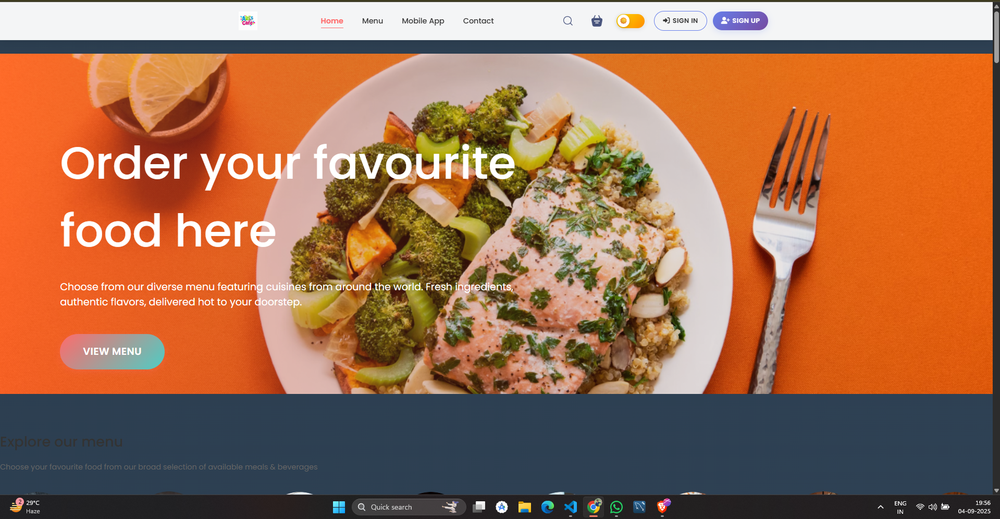
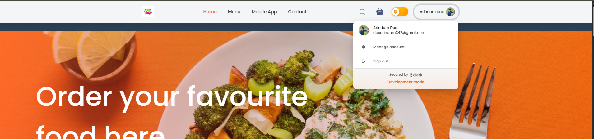
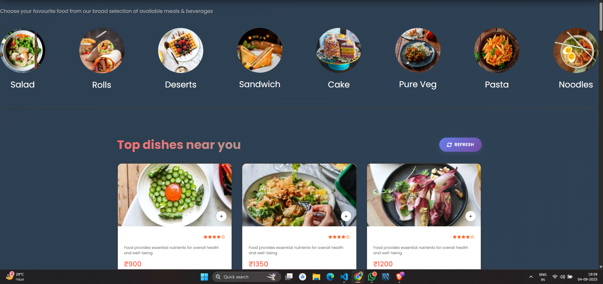
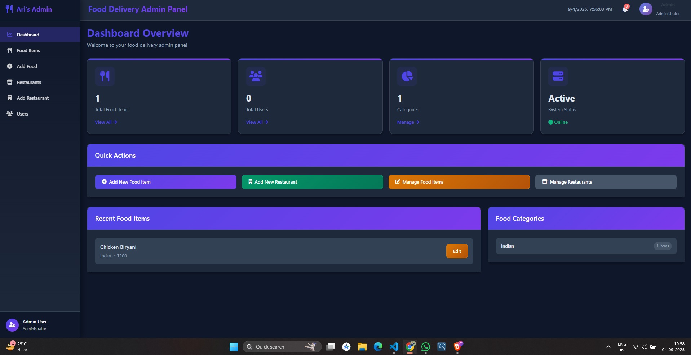
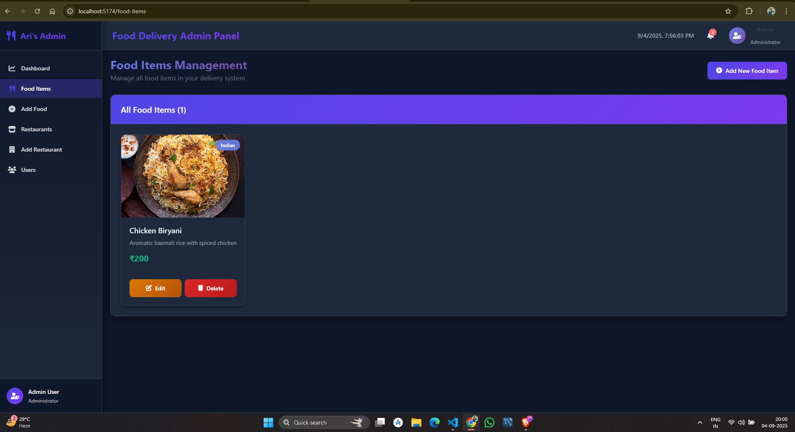

# IBM-Final-Project-
A fully functional full-stack project(food_delivery app) built with React, Node.js, Express.js, and MongoDB (Compass), featuring secure authentication powered by Clerk.
The Uimage of the project is as follows:
Main Page

Login Page

Menu Page

Admin Page

Add Food Using admin Page
